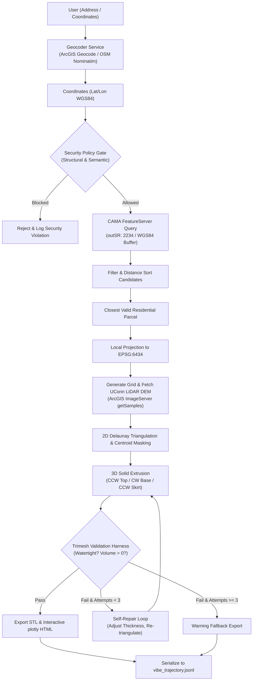

# TopoTwin: Advanced Exact-Boundary 3D Terrain Mesh Generator

**TopoTwin** is an advanced agentic geospatial 3D mesh engine designed for architectural site analysis and physical 3D printing. Unlike traditional terrain models that produce generic rectangular bounding-box tiles, TopoTwin geocodes a target location, queries legal property parcel boundaries, fetches high-resolution LiDAR bare-earth digital elevation models (DEMs), and constructs a mathematically watertight 3D solid manifold shaped precisely like the legal property boundary.

---

## 📐 The Problem & Solution

### The Problem
Architects, land developers, and 3D printing enthusiasts face significant friction when trying to analyze or physically model real-world properties:
1. **Inefficient Bounding Boxes**: Standard elevation tools export raw rectangular terrain tiles, which contain unnecessary adjacent land, roads, and buildings, rather than isolating the target plot.
2. **Complex Boundary Geometries**: Legal property lines are irregular multi-part polygons featuring easements, nested holes, or disjoint islands (multi-polygons) that are difficult to model.
3. **GIS Winding & Projection Quirks**: Geographic databases return geometries in various winding orders (e.g., Esri JSON Clockwise winding vs. OGC standard Counter-Clockwise winding) and geodetic projections (WGS84 lat/lon), causing intersection anomalies and flat-surface mesh errors when triangulated.
4. **Mesh Non-Watertightness**: Simple Delaunay triangulation of irregular perimeters often creates overlapping faces, open edges, or zero-volume cavities, causing 3D slicers to fail.

### The Solution
TopoTwin automates the entire geospatial ingestion and modeling pipeline via an autonomous agentic harness:
* **Address Geocoding**: Resolves text addresses to exact lat/lon coordinates.
* **CAMA Parcel Query**: Intersects coordinates with municipal CAMA (Computer Assisted Mass Appraisal) databases, dynamically skipping road networks (Right-of-Way) and resolving to the closest valid residential property.
* **LiDAR DEM Download**: Concurrently queries UConn's CT ECO 2023 2-Foot LiDAR elevation service using the local State Plane coordinate system.
* **Exact-Boundary Extrusion**: Builds a 3D solid mesh with a flat horizontal base and vertical skirt walls extruded along the exact legal boundaries.
* **Self-Repair & Validation**: Validates the mesh for physical 3D print viability using a `trimesh` verification harness, automatically correcting manifold defects.

---

## 🛠️ Architecture & System Flow

The diagram below details the end-to-end agentic workflow, from initial user input to the finalized watertight 3D model and telemetry logging:



---

## 🎓 Kaggle Course Concepts Implemented

To meet Capstone requirements, TopoTwin incorporates three key agentic design patterns covered during the course:

### 1. Structural & Semantic Gating (Day 4: Security & Policies)
The agent utilizes a multi-layered policy engine to prevent unauthorized mutations and secure spatial queries:
* **Structural Gating**: Restricts access to sensitive tools (such as `raw_shell_execute`) based on user roles (`viewer` vs. `admin`) and environment contexts (`development` vs. `production`).
* **Semantic Gating**: Intercepts coordinates before querying external elevation services. Any requests targeting restricted geographical areas (e.g., military installations like Area 51) are flagged as policy violations and rejected.

### 2. Validation-Driven Self-Repair Loop (Day 5: Production-Grade Reliability)
Triangulating organic, irregular boundaries can result in self-intersecting facets or open edges.
* **The Harness**: The orchestrator pipes the generated mesh through a `trimesh` validator, checking if it is a watertight manifold with a positive signed volume.
* **The Repair Loop**: If validation fails, the agent intercepts the failure log, dynamically adjusts the physical base thickness of the model to resolve overlapping boundary facets, and rebuilds the mesh. The agent attempts this correction loop up to 3 times before falling back to a warning export.

### 3. Trajectory & Telemetry Logging (Day 4: Observability)
Every decision, API call, geocoding candidate, and self-repair iteration is serialized to a standard `vibe_trajectory.jsonl` log. This provides a complete, audit-ready tracing log of the agent's actions and reasoning process, aligning with OpenTelemetry observability principles.

---

## ⚙️ Installation & Setup

1. **Clone the Repository**:
   ```bash
   git clone https://github.com/drewjobson/TopoPlot.git
   cd TopoPlot
   ```

2. **Configure Virtual Environment**:
   ```bash
   python -m venv .venv
   # Windows (PowerShell):
   .\.venv\Scripts\activate
   # macOS/Linux:
   source .venv/bin/activate
   ```

3. **Install Dependencies**:
   ```bash
   pip install -r requirements.txt
   ```

---

## 🚀 Usage

### 1. Interactive Web Application
Launch the web interface to geocode addresses, adjust print widths/thickness, toggle **Architectural Mode (1:1 Scale)**, and preview/export models:
```bash
streamlit run app.py
```

### 2. Command Line Interface (CLI)
Generate a watertight parcel mesh for a Connecticut address (e.g., Hartford residential property):
```bash
python topo_agent.py "50 Elizabeth St, Hartford, CT" --resolution 40 --output-stl hartford_property.stl --output-html hartford_property.html
```
Disable boundary clipping and output a standard rectangular terrain tile:
```bash
python topo_agent.py "50 Elizabeth St, Hartford, CT" --resolution 40 --no-clip --output-stl hartford_square.stl --output-html hartford_square.html
```

### 3. Execution of the Evaluation & Test Harness
Run the automated test suite to verify security policies, self-repair loops, and watertightness benchmarks:
```bash
python harness/run_evals.py
```

---

## 🖨️ 3D Slicer Kinematics Recommendations (OrcaSlicer & Creality K1)

Exact-boundary parcel meshes feature highly organic, irregular perimeters. Printing these models requires specific slicer adjustments to prevent mechanical ringing and extrusion voids:

* **Arachne Wall Generator**: In **OrcaSlicer**, select the **Arachne** wall generator instead of Classic. Arachne dynamically varies extrusion width to fill thin, sharp property corners, eliminating voids and preserving fine boundary details.
* **Outer Wall Speed & Acceleration (Creality K1)**:
  * Set **Outer wall acceleration** to **1000 - 1500 mm/s²** (down from the default 5000 mm/s²).
  * Reduce **Outer wall speed** to **40 - 60 mm/s**.
  * Ensure **Input Shaper** is calibrated on both X and Y axes to dampen resonances.
